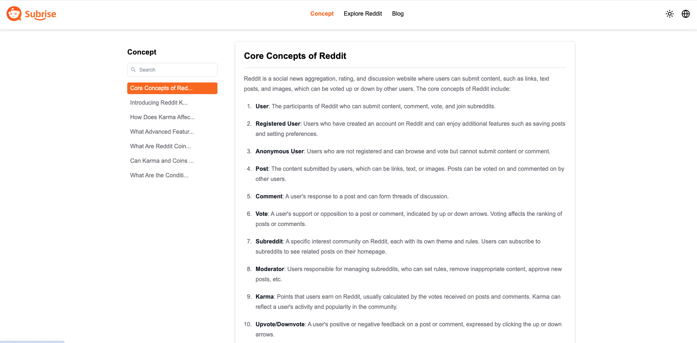
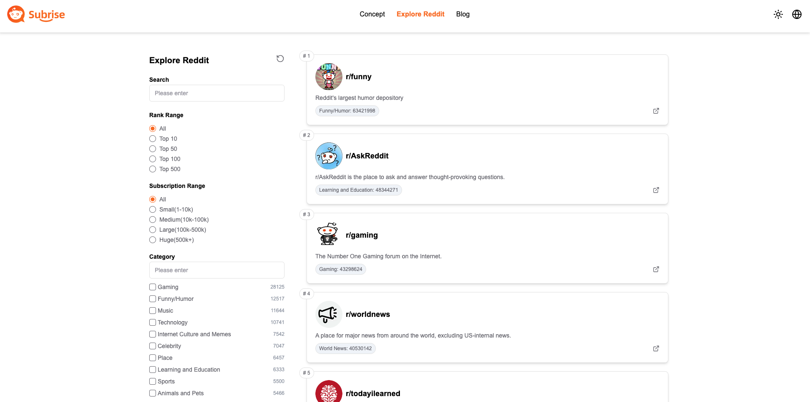
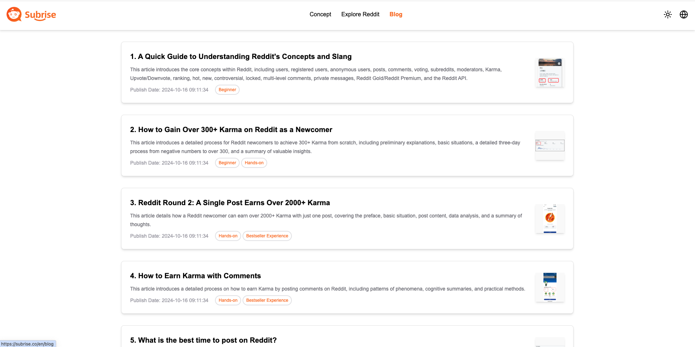

# Subrise 是一个专业的 Reddit 流量变现工具，旨在帮助创业者在海外扩展业务

## 网站 
- [Subrise](https://subrise.co)

## 网站截图
- 首页

- 概念科普

- 探索Reddit

- 干货总结


## 项目介绍
1. 基于 Next.js 和 Tailwind CSS 开发， 页面组件使用 shadcn/ui 实现, 网站地址：https://subrise.co
2. 项目使用 Drizzle ORM 连接数据库, 数据库使用 Wrangler D1, 配置参数在 .env 中
3. 项目国际化使用 next-intl 实现, 目前支持中英文切换

## 项目启动


```bash
# 克隆项目
git clone https://github.com/AI-goes-to-sea/reddit101.git

# 进入项目目录
cd reddit101

# 安装依赖
npm install
# or
yarn dev
# or
pnpm dev
# or
bun dev
```

打开 [http://localhost:3000](http://localhost:3000) 查看页面.

## 技术文档
- [Next.js](https://nextjs.org/docs)
- [Tailwind CSS](https://tailwindcss.com/docs)
- [shadcn/ui](https://ui.shadcn.com/docs)
- [Drizzle ORM](https://drizzle.dev/docs)
- [Wrangler D1](https://developers.cloudflare.com/d1/wrangler-d1/)
- [next-intl](https://next-intl-docs.vercel.app/docs/introduction)

## 相关链接
- https://sites.google.com/view/subrise/home
- https://linktr.ee/MineZheng
- https://winwiz.gitbook.io/winwiz/
- https://blossom-caboc-dab.notion.site/Subrise-Your-Reddit-traffic-nugget-tool-12e6d43113f780ce8c0ecaf067d555d7
- https://rebrand.ly/subrise

## 版权声明
- 项目代码开源，遵循 MIT 协议， 请遵守协议内容
